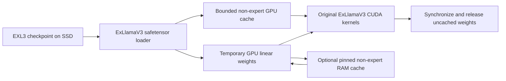

# Loading architecture

This section describes the original adapter, preserved as the default.
Version 0.2 adds a separate Windows `--optimized` adapter with direct SSD I/O,
embedding row reads, expert prefetch/cache and verified MTP/lookup.
See [optimized architecture and verification](OPTIMIZATION.md).

`WeightManager.patch()` temporarily replaces `Linear.load` and `Linear.unload`.
Routers remain native because the MoE routing code accesses their weights directly.
Other linear modules receive a proxy tagged `ssd_stream`, disabling full-bank
fused expert paths that assume resident weight pointers.

On a forward call, the manager first checks the permanent GPU cache. A miss loads
the original quantized native implementation from the checkpoint, or uploads the
pinned CPU copy. The original native implementation computes the output. A
non-routed matrix can be admitted if its native CUDA storage fits the static
budget. Otherwise, a non-routed EXL3 matrix may enter the pinned CPU cache. Routed
expert matrices are never admitted. CUDA synchronization precedes releasing a
temporary implementation so in-flight kernels cannot reference freed allocations.

The GPU cache is static admission, not LRU. This avoids cycling the complete
working set through a cache smaller than the trunk. It also leaves optimization
opportunities: first-use admission is not necessarily the best allocation.
Router, embedding, norm and some MLA data remain eager/resident outside this cache.

Each `forward_tokens` call builds a fresh parameter dictionary. ExLlamaV3 memoizes
DSA host lengths and device tensors in it; reusing one dictionary across positions
can retain stale sequence metadata. The regression oracle exercises the same helper.

Prefill uses chunks of 16 tokens. Decode uses one token per step, choosing the
highest logit and checking for finite outputs and the checkpoint's EOS IDs.
The published HF chat template opens the reasoning channel; a result needs
`</think>` followed by nonempty content to count as a final answer.

The patch is global within the Python process. Do not construct concurrent engines,
share one engine across threads, or load a separate resident model while it is active.
The engine restores the patched methods and closes safetensor handles on teardown.

The adapter depends on ExLlamaV3's internal `Linear` and `LinearEXL3` APIs. Pinning
the version and testing against resident computations are essential for maintenance.
